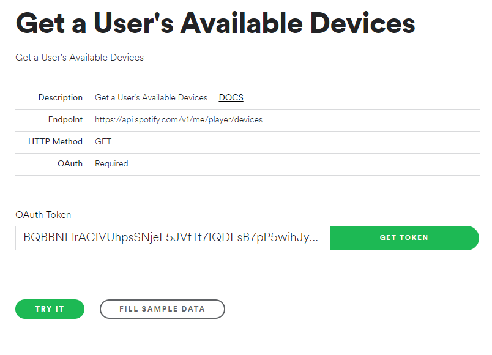
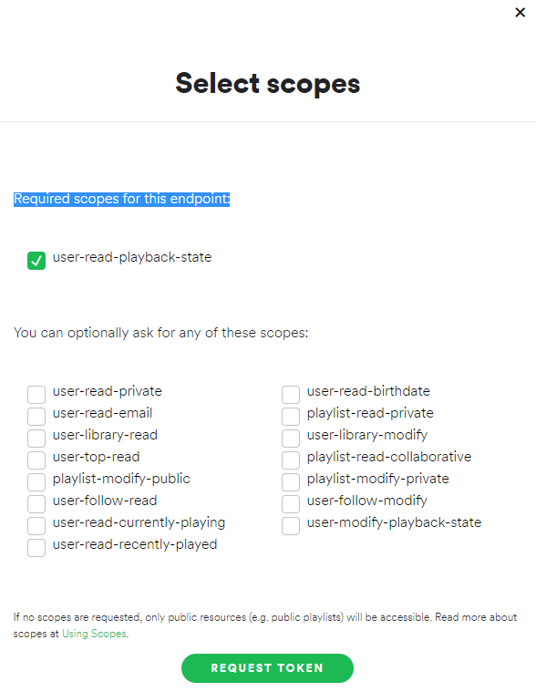
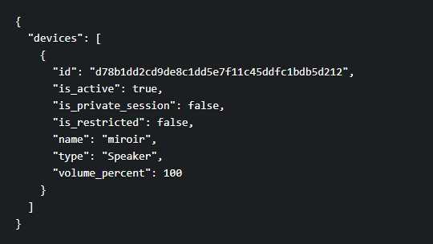

# MMM-SpotifyControl
A module for the [MagicMirror](https://github.com/MichMich/MagicMirror) project by [Michael Teeuw](https://github.com/MichMich) to control ( Play/pause/forward etc... ) song on Spotify.

## Credits
To Be written 

## How it works

This Module allow to control Spotify player on your Mirror . 
For now you can only control a single device. It could be your mirror if you are running Raspotify on it. 


## Installing
Installing the module is quite straight forward. Getting it to display your playing songs requires a bit more work.

### Step 1 – Install the module

In your MagicMirror directory: 

```bash
cd modules
git clone https://github.com/ejay-ibm/MMM-SpotifyControl.git
cd MMM-SpotifyControl
npm install
```

### Step 2 – Create and authorize a Spotify app
In order to be able to connect to the Spotify API you need to create an app in the [Spotify developer area](https://beta.developer.spotify.com/dashboard/applications). Then you need to authorise the app to access your personal data. Et voilà!

The module provides you with a special app which describes all the necessary steps and which guides you through the whole process. To use this app change into the `authorization` folder and start the app by typing `node app`. 

```bash
cd authorization
node app
```

When the app is running you can access it by opening `localhost:8888` in your browser. Provided you are doing this directly on your Raspberry Pi. If you want to access the app remotely just type the ip address or the name of your Raspberry like so for instance: `http://raspi:8888`.

Now just follow the steps described there. After successful authorisation the app will display a code snippet under the heading 

### Step 3: Configure your mirror**. Copy that snippet and paste it into your mirror’s `config.js`. Configure the rest to your needs and you’re good to go.

** If you are using NowPlayingOnSpotify Module already I suggest to update your Tokens as well in this module so both module will use the same tokens. do not use NowPlayingOnSpotify tokens as they have less permissions. 

### Step 4: Get your DeviceId**.

Important ! Play a song on the desired device else it will not be shown then :

In your browser go to : 
(https://developer.spotify.com/console/get-users-available-devices/)



Click on Get token and select the scope : 

 
 
The Click Request Token then Try It !  

On the left side you can see the deviceId matching with your device.

 

Copy the id and keep it for Step 4 . 


Here is an example for an entry in `config.js`

```javascript
{
    module: "MMM-SpotifyControl",

    config: {
        clientID: "<YOUR_CLIENT_ID>",
        clientSecret: "<YOUR_CLIENT_SECRET>",
        accessToken: "<YOUR_ACCESS_TOKEN>",
        refreshToken: "<YOUR_REFRESH_TOKEN>",
        deviceName: "<DEVICEID>"   // See Step 4
    }
}
```

**Step 5: configure hook and command for the Mk2 assistant**.

Here is a sample of hook and command set in your config.js file for your Mk2 assistant Module. 


~~~~
transcriptionHook: {
        PREV_SONG: {
           pattern: "previous song",   
           command: "PREV_SONG"
      },

        PAUSE_SPOTIFY: {
            pattern: "stop the music",
            command: "PAUSE_SPOTIFY"
        },
        RESUME_SPOTIFY: {
            pattern: "resume music",
            command: "RESUME_SPOTIFY"
        },
        PLAY_NEXT_SPOTIFY: {
            pattern: "next song",
            command: "PLAY_NEXT_SPOTIFY"
        },
    },
    command: {


        PAUSE_SPOTIFY: {
            notificationExec: {
                notification: "PAUSE_SPOTIFY"
            }
        },

        RESUME_SPOTIFY: {
            notificationExec: {
                notification: "RESUME_SPOTIFY"
            }
        },

        PLAY_NEXT_SPOTIFY: {
            notificationExec: {
                notification: "PLAY_NEXT_SPOTIFY"
            }
        },

        PREV_SONG: {
            notificationExec: {
               notification: "PLAY_PREVIOUS_SPOTIFY"  
         }
        },

    }

~~~~
### Usage : 
    
   You are now all set ! Start your mirror and say " Play Bob Marley on Spotify" ... and chill...  
   
    
### Known Issues : 

* if raspotify just jump back to track start instead of changing the song, an update of raspotify is needed. 
* Previous song doesn't jump to the previous track , but restart the current one. No solution for this one. This is how the Spotify api works. 


